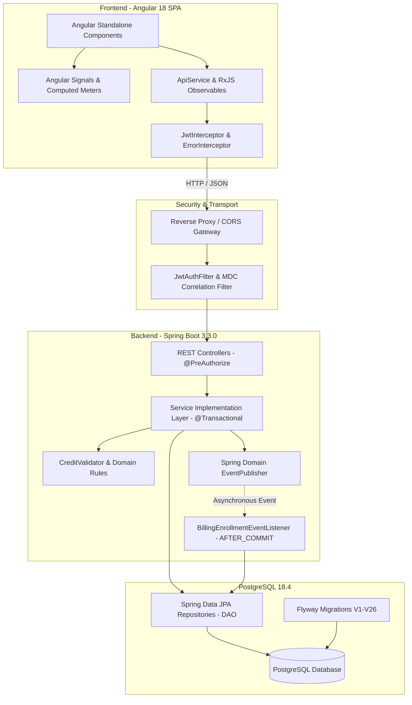
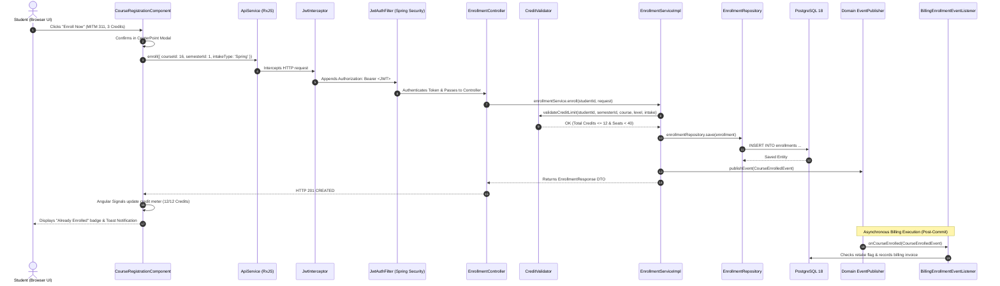
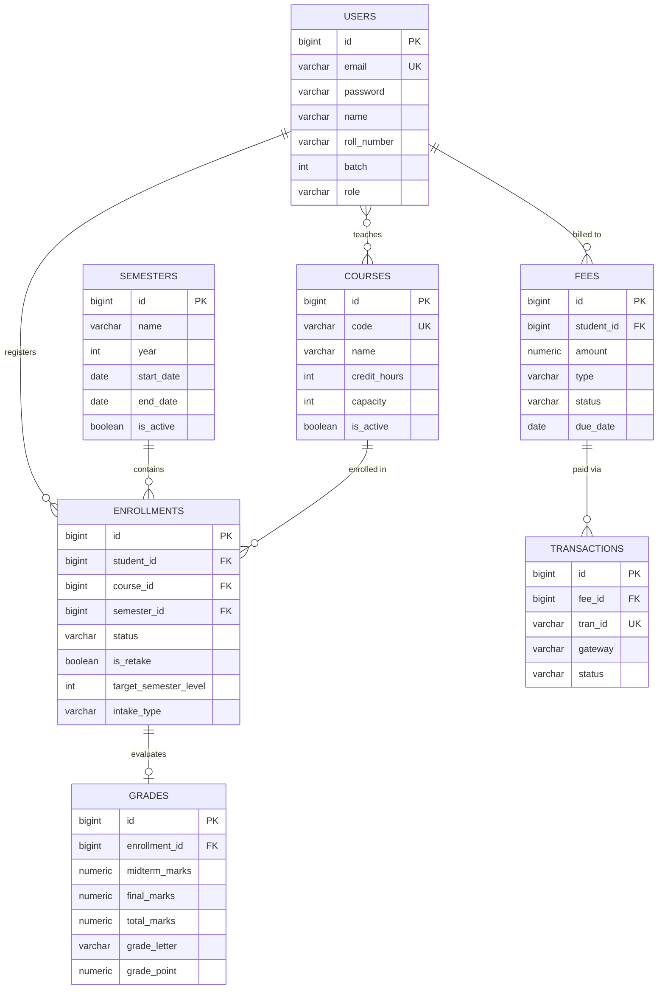

# 🎓 MIT Open Credit Management System (OCMS)
### *Enterprise Student Lifecycle, Dynamic Credit Validation & Academic Governance Platform*

<p align="center">
  
  
  
  
  
  
  
</p>

---

## 📑 Table of Contents

1. [🏛️ Institutional Context & Project Overview](#️-institutional-context--project-overview)
2. [🌟 Flagship Innovations & Core Features](#-flagship-innovations--core-features)
   - [🆔 Dynamic Semester Roll ID System](#1--dynamic-semester-roll-id-generation-system)
   - [⚡ Academic Governance & Credit Caps](#2--academic-governance--credit-capping-engine)
   - [💳 Domain-Driven Event Billing & SSLCommerz](#3--domain-driven-event-billing--payment-integration)
   - [📄 Official University Transcript Generation](#4--official-academic-transcript-generation)
3. [📚 Active Curriculum & Course Catalog (3 Semesters)](#-active-curriculum--course-catalog-3-semesters)
4. [🎯 University of Dhaka Standard Grading Scale](#-university-of-dhaka-standard-grading-scale)
5. [🏛️ System Architecture & Data Model](#️-system-architecture--data-model)
   - [Layered Architecture Diagram](#layered-architecture)
   - [End-to-End Registration Flow Diagram](#end-to-end-registration-flow)
   - [Entity-Relationship Diagram (ERD)](#entity-relationship-diagram-erd)
6. [🖥️ Portals & Functional Workspaces](#️-portals--functional-workspaces)
   - [Student Portal](#-1-student-portal-modules)
   - [Faculty Portal](#-2-faculty-teacher-portal-modules)
   - [Administrator Portal](#-3-administrator-portal-modules)
7. [🛠️ Complete Technology Stack](#️-complete-technology-stack)
8. [🗄️ Database Migrations History (Flyway V1–V26)](#️-database-migrations-history-flyway-v1v26)
9. [🛡️ Enterprise Security, Resilience & Observability](#️-enterprise-security-resilience--observability)
10. [👥 Demo Credentials & Test Accounts](#-demo-credentials--test-accounts)
11. [🚀 Quickstart & Local Installation Guide](#-quickstart--local-installation-guide)
12. [🧪 Testing & Quality Assurance (84/84 Passing)](#-testing--quality-assurance-8484-passing)
13. [📡 Comprehensive REST API Reference](#-comprehensive-rest-api-reference)
14. [❓ Frequently Asked Questions & Troubleshooting](#-frequently-asked-questions--troubleshooting)
15. [🏛️ Academic Attribution & Acknowledgments](#️-academic-attribution--acknowledgments)

---

## 🏛️ Institutional Context & Project Overview

Developed for the **Institute of Information Technology (IIT), University of Dhaka** as the flagship **8th Semester Software Project Lab 3 (SPL-3)** capstone project, the **MIT Open Credit Management System (OCMS)** is an enterprise academic lifecycle, curriculum governance, and credit validation platform.

### The Problem It Solves
Traditional university enterprise resource planning (ERP) systems operate on rigid, synchronous semester models. In contrast, modern specialized graduate and undergraduate programs (such as IIT's Evening MIT and BSSE curricula) feature flexible, multi-intake pathways:
* Students may enroll across multiple intake cycles (**Spring or Fall**).
* Course registrations must respect a strict **12-credit ceiling per term** and a **40-student seat limit per course section**.
* Skipped terms must be audited for institutional **gap penalties (BDT 10,000)**.
* Repeat enrollments must automatically generate **retake invoices (BDT 500 per credit)**.
* Students require immediate, on-demand official **academic transcripts** with accurate Grade Point Average (GPA) calculations.

The **MIT OCMS** addresses these challenges through a modern, reactive Single Page Application (SPA), decoupled event-driven backend services, and a relational persistence architecture with 26 automated Flyway migrations.

---

## 🌟 Flagship Innovations & Core Features

### 1. 🆔 Dynamic Semester Roll ID Generation System

The system dynamically derives an immutable, university-standard semester roll identifier for every enrolled student in every term conforming to a 5-component concatenation schema:

$$\mathbf{YY} + \mathbf{TermCode} + \mathbf{TermType} + \mathbf{Batch} + \mathbf{ClassRoll}$$

#### 🧩 Semester Roll Component Breakdown:

| Component | Format | Description | Accepted / Generated Values |
| :--- | :---: | :--- | :--- |
| **`YY`** | 2 Digits | Academic Calendar Year | `25` (2025), `26` (2026), `27` (2027) |
| **`TermCode`** | 1 Char | Academic Term Level | `F` (1st Semester), `S` (2nd Semester), `T` (3rd Semester) |
| **`TermType`** | 1 Char | Intake Cycle | `S` (Spring Intake), `F` (Fall Intake) |
| **`Batch`** | 2 Digits | Program Cohort Number | `14` (Batch 14), `02` (Batch 2) |
| **`ClassRoll`** | 2 Digits | Student Roll Number | `13` (Roll 13), `04` (Roll 04) |

#### 📋 Semester Roll Variations for Student 1413 (Batch 14, Roll 13):

| Academic Semester Level | Intake Cycle | Year | Derived Semester Roll | Meaning |
| :--- | :--- | :---: | :---: | :--- |
| **First Semester** | **Spring** | 2026 | **`26FS1413`** | Year 2026, 1st Term, Spring Intake, Batch 14, Roll 13 |
| **First Semester** | **Fall** | 2026 | **`26FF1413`** | Year 2026, 1st Term, Fall Intake, Batch 14, Roll 13 |
| **Second Semester** | **Spring** | 2026 | **`26SS1413`** | Year 2026, 2nd Term, Spring Intake, Batch 14, Roll 13 |
| **Second Semester** | **Fall** | 2026 | **`26SF1413`** | Year 2026, 2nd Term, Fall Intake, Batch 14, Roll 13 |
| **Third Semester** | **Spring** | 2026 | **`26TS1413`** | Year 2026, 3rd Term, Spring Intake, Batch 14, Roll 13 |
| **Third Semester** | **Fall** | 2026 | **`26TF1413`** | Year 2026, 3rd Term, Fall Intake, Batch 14, Roll 13 |

#### 🔍 Universal Roll Number Regex Matching Engine:

```regex
^(\d{2})([SFT123])([SF]?)([0-9]{2})(\d{2,4})$
```

| Pattern Class | Example Input | Regex Match Resolution | Parsed Batch | Parsed Roll |
| :--- | :--- | :--- | :---: | :---: |
| **New 5-Part Dynamic** | `26FS1413` | Year `26`, Term `F`, Intake `S`, Batch `14`, Roll `13` | `14` | `13` |
| **Legacy 4-Part Dynamic**| `26S0204` | Year `26`, Term `S`, Intake `null`, Batch `02`, Roll `04` | `2` | `4` |
| **Legacy BSSE Format** | `BSSE1204` | `^BSSE(\d{2})(\d{2})$` $\rightarrow$ Batch `12`, Roll `04` | `12` | `4` |
| **Standard 4-Digit Roll**| `1413` | `^(\d{2})(\d{2})$` $\rightarrow$ Batch `14`, Roll `13` | `14` | `13` |

---

### 2. ⚡ Academic Governance & Credit Capping Engine

| Policy | Academic Rule | Technical Enforcement | Failure Handling |
| :--- | :--- | :--- | :--- |
| **Semester Credit Ceiling** | Maximum **12 Credit Hours** per semester level & intake | Evaluated in `CreditValidator.java` via JPQL sum before persistence | Throws `BusinessRuleException` (HTTP 400); Angular UI disables enroll buttons |
| **Course Section Capacity** | Maximum **40 Students** per course section | Thread-safe row counting in `EnrollmentRepository` | Throws `CourseFullException` (HTTP 409) |
| **Curriculum Separation** | Specific courses strictly bound to 1st, 2nd, or 3rd semester | `target_semester_level` foreign key constraint & JPA grouping | Prevents cross-semester course leakage |
| **Duplicate Enrollment Guard**| Cannot enroll same course in same term twice | PostgreSQL composite unique constraint: `(student_id, course_id, semester_id)` | Database constraint violation handled gracefully |

---

### 3. 💳 Domain-Driven Event Billing & Payment Integration

| Fee Category | Institutional Rate | Billing Trigger | Processing Mode |
| :--- | :--- | :--- | :--- |
| **Semester Registration Fee**| Base Tuition (BDT 15,000–25,000) | Initial term activation | Synchronous invoice generation |
| **Gap Semester Fine** | **BDT 10,000** per un-enrolled term | Detected when student skips a chronological term post-matriculation | Asynchronous domain event evaluation (`CourseEnrolledEvent`) |
| **Course Retake Fee** | **BDT 500** per credit hour | Flagged when student re-registers a previously taken course | Handled via `@TransactionalEventListener(phase = AFTER_COMMIT)` |
| **Online Payment Gateway** | Exact Invoice Total (BDT) | Initiated via Student Portal Checkout button | **SSLCommerz Sandbox Gateway** (IPN callback confirmation) |

---

### 4. 📄 Official Academic Transcript Generation

| Transcript Component | Data Source | Calculation / Processing Standard | Output Format |
| :--- | :--- | :--- | :--- |
| **Header & Student Meta** | `User`, `Semester` entities | Institutional title, Registration No, Dynamic Semester Roll | Vector Helvetica Bold typography |
| **Course Grades Grid** | `Enrollment`, `Grade` entities | Course Code, Title, Credits, Letter Grade, Grade Point | Formatted 6-column tabular layout via OpenPDF |
| **SGPA & CGPA Calculation** | `GradeCalculator.java` | Dhaka University standard 4.00 Grade Point scale | Rounded to 2 decimal places with safety margins |
| **Document Delivery** | `TranscriptService.java` | In-memory `ByteArrayOutputStream` streaming | Instant downloadable PDF (`application/pdf`) |

---

## 📚 Active Curriculum & Course Catalog (3 Semesters)

The active curriculum for the **Executive Master in Information Technology (EMIT)** program is organized into 3 distinct progression levels:

### 📗 First Semester (12 Credits Total — All Mandatory Core)
| Course Code | Course Title | Credits | Type | Assigned Faculty Instructor |
| :--- | :--- | :---: | :---: | :--- |
| **`MITM 303`** | Advanced Computer Networks & Internetworking | 3 | Core | **Dr. Md. Shariful Islam** (Professor) |
| **`MITM 304`** | Database Architecture and Administration | 3 | Core | **Mohammed Shoyaib** (Professor) |
| **`MITM 310`** | Advanced Data Structures and Algorithms | 3 | Core | **Dr. Ahmedul Kabir** (Associate Professor) |
| **`MITM 311`** | Advanced Object-Oriented Programming | 3 | Core | **Dr. B. M. Mainul Hossain** (Professor) |

### 📘 Second Semester (12 Credits Max — Core + Technical Electives)
| Course Code | Course Title | Credits | Type | Assigned Faculty Instructor |
| :--- | :--- | :---: | :---: | :--- |
| **`MITM 301`** | IT Project Management | 3 | Core | **Md. Saeed Siddik** |
| **`MITM 305`** | Web Technology and Internet Computing | 3 | Core | **Dr. Md. Nurul Ahad Tawhid** |
| **`MITE 435`** | Software Design Pattern | 3 | Elective | **Toukir Ahammed** |
| **`MITE 439`** | Software Requirements Engineering and Design | 3 | Elective | **Dr. Kazi Muheymin-Us-Sakib** |
| **`MITE 430`** | Machine Learning | 3 | Elective | Faculty Assigned |
| **`MITE 434`** | Software Quality Assurance and Testing | 3 | Elective | Faculty Assigned |

### 📙 Third Semester (12 Credits Max — Capstone + Electives)
| Course Code | Course Title | Credits | Type | Assigned Faculty Instructor |
| :--- | :--- | :---: | :---: | :--- |
| **`MITM 421`** | Project for MIT / Internship | 6 | Core | **Dr. Ahmedul Kabir** (Associate Professor) |
| **`MITE 431`** | Big Data Analytics | 3 | Elective | **Dr. B. M. Mainul Hossain** (Professor) |
| **`MITE 441`** | Software Maintenance and Analytics | 3 | Elective | **Toukir Ahammed** |
| **`MITE 432`** | Cryptography and Security Mechanisms | 3 | Elective | Faculty Assigned |
| **`MITE 433`** | Cyber Security | 3 | Elective | Faculty Assigned |
| **`MITE 436`** | Artificial Intelligence | 3 | Elective | Faculty Assigned |

---

## 🎯 University of Dhaka Standard Grading Scale

As implemented in [`GradeLetter.java`](file:///d:/8th%20Semester/SPL3-main-Deploy-Version-Copy/backend/src/main/java/com/iit/creditmanagement/model/enums/GradeLetter.java) and verified by [`GradeCalculatorTest.java`](file:///d:/8th%20Semester/SPL3-main-Deploy-Version-Copy/backend/src/test/java/com/iit/creditmanagement/unit/util/GradeCalculatorTest.java):

| Total Numerical Marks (100) | Letter Grade | Grade Point (GP) | Qualitative Assessment | Academic Status |
| :---: | :---: | :---: | :--- | :---: |
| **80% and above** | **A+** | **4.00** | Outstanding | Passed |
| **75% to 79%** | **A** | **3.75** | Excellent | Passed |
| **70% to 74%** | **A-** | **3.50** | Very Good | Passed |
| **65% to 69%** | **B+** | **3.25** | Good | Passed |
| **60% to 64%** | **B** | **3.00** | Satisfactory | Passed |
| **55% to 59%** | **B-** | **2.75** | Above Average | Passed |
| **50% to 54%** | **C+** | **2.50** | Average | Passed |
| **45% to 49%** | **C** | **2.25** | Below Average | Passed |
| **40% to 44%** | **D** | **2.00** | Pass | Passed |
| **Below 40%** | **F** | **0.00** | Fail | Retake Required |

$$\text{SGPA / CGPA} = \frac{\sum (\text{Grade Point}_i \times \text{Credit Hours}_i)}{\sum \text{Credit Hours}_i}$$

---

## 🏛️ System Architecture & Data Model

### Layered Architecture



### End-to-End Registration Flow



### Entity-Relationship Diagram (ERD)



---

## 🖥️ Portals & Functional Workspaces

### 🎓 1. Student Portal Modules

| Module Name | Path | Key Capabilities | Technical Highlights |
| :--- | :--- | :--- | :--- |
| **Student Dashboard** | `/student/dashboard` | Real-time overview of current term roll (`26FS1413`), CGPA, dues, and announcements | Reactive state loaded via `AuthStateService` |
| **Course Registration** | `/student/register` | Semester-wise course selection (1st, 2nd, 3rd) and intake cycle toggle (Spring/Fall) | Angular 18 Computed Signals; 12-credit visual cap meter |
| **My Courses** | `/student/my-courses` | Listing of currently registered and completed courses with instructor details | Status badges (`ACTIVE`, `COMPLETED`, `RETAKE`) |
| **Academic History** | `/student/history` | Chronological multi-term progression, SGPA/CGPA breakdown, and gap detection | Chart.js visual GPA trends; dynamic semester rolls |
| **Financial Dues** | `/student/dues` | Itemized invoice ledger (tuition, retakes, gap fines) with online payment checkout | Integrated **SSLCommerz Payment Gateway** |
| **Official Transcript** | `/student/history` | On-demand official academic transcript PDF download | Streamed from server-side OpenPDF engine |

---

### 👨‍🏫 2. Faculty (Teacher) Portal Modules

| Module Name | Path | Key Capabilities | Technical Highlights |
| :--- | :--- | :--- | :--- |
| **Teacher Dashboard** | `/teacher/dashboard` | Summary of assigned courses, enrolled students, and pending grading tasks | Metric cards with real-time counts |
| **Course Rosters** | `/teacher/courses` | Complete list of enrolled students per section (enforcing 40-seat max) | Pagination, sorting, and student search |
| **Inline Grade Entry** | `/teacher/grades` | Spreadsheet-like inline marks entry: Midterm (40%) + Final (60%) | Auto-computation of Total, Letter Grade, and Grade Point |
| **CSV Batch Upload** | `/teacher/grades` | Download roster CSV template, edit marks offline, batch upload marks | Apache Commons CSV parser with validation |
| **Student History Search**| `/teacher/students` | Search any student by Roll, Email, or Semester Roll (`26FS1413`) | Complete transcript and CGPA visibility |

---

### 🛡️ 3. Administrator Portal Modules

| Module Name | Path | Key Capabilities | Technical Highlights |
| :--- | :--- | :--- | :--- |
| **Admin Dashboard** | `/admin/dashboard` | System-wide statistics: total students, faculty, active courses, fee revenue | Chart.js financial and enrollment graphs |
| **Semester Governance** | `/admin/semesters` | Configure academic calendar years, term levels, dates, and activate terms | Multi-term active support via Flyway V7 |
| **Course Catalog** | `/admin/courses` | Create/modify courses, credit hours, mandatory/elective flags, assign faculty | Foreign key linkage to faculty instructors |
| **User Directory** | `/admin/students` | Student & Teacher directory, batch assignments, password resets | Role-based entity management with search |
| **Fee Auditing** | `/admin/fees` | Financial ledger oversight, gap penalty tracking, payment reconciliation | Real-time aggregate queries via JPA |
| **Degree Clearance** | `/admin/clearance` | Automated degree audit against curriculum criteria; 1-click clearance approval | Validates minimum 2.50 CGPA & zero incomplete grades |

---

## 🛠️ Complete Technology Stack

| Architectural Layer | Technology / Library | Version | Technical Role in Project |
| :--- | :--- | :---: | :--- |
| **Frontend Framework** | Angular | `18.0.0` | Modern SPA with Standalone Components & Signal architecture |
| **Reactive State** | RxJS | `7.8.0` | Reactive streams, asynchronous pipelines, and HTTP observables |
| **Type System** | TypeScript | `5.4.0` | End-to-end type safety for interfaces, models, and DTOs |
| **Styling & UI** | Vanilla CSS | CSS3 | Custom design system with modern dark-mode aesthetic |
| **Visual Charts** | Chart.js & ng2-charts | `4.5.1` | Interactive GPA trend lines and credit distribution charts |
| **Client-Side PDF** | jsPDF & AutoTable | `4.2.1` | Client-side report generation and tabular document export |
| **Backend Runtime** | Java OpenJDK | `21 LTS` | Modern Java features (Records, Pattern Matching, Sealed Types) |
| **Enterprise Core** | Spring Boot | `3.3.0` | IoC, Dependency Injection, REST MVC, and Auto-configuration |
| **Security & Auth** | Spring Security | `6.3.0` | Stateless token authentication, CORS filters, `@PreAuthorize` |
| **Persistence & ORM** | Spring Data JPA / Hibernate | `6.5.2` | Data Access Object (DAO) pattern and JPQL query abstraction |
| **Stateless Tokens** | JJWT (Java JWT) | `0.12.5` | HMAC-SHA256 token issuance, claim extraction, and validation |
| **Server-Side PDF** | OpenPDF (iText fork) | `1.3.39` | High-fidelity server-side official transcript PDF generation |
| **Fault Tolerance** | Resilience4j | `2.2.0` | Circuit breaker, fallback handlers, and automated retries |
| **In-Memory Cache** | Caffeine Cache | `3.1.8` | Near-cache for active semesters, courses, and CGPA metrics |
| **Traffic Defense** | Bucket4j Core | `8.9.0` | Token-bucket rate limiting defending critical endpoints |
| **API Documentation** | SpringDoc OpenAPI | `2.5.0` | Automatic Swagger interactive API explorer (`/swagger-ui.html`) |
| **Observability** | Spring Boot Actuator & Micrometer | `3.3.0` | Production health checks, Prometheus metrics, SLF4J MDC |
| **Relational Database**| PostgreSQL | `18.4` | Primary relational database with ACID transactional guarantees |
| **Schema Migrations** | Flyway DB | `10.13.0`| Version-controlled, reproducible SQL database migrations (V1–V26) |
| **Unit & Mock Tests** | JUnit 5 & Mockito | `5.10.2`| Comprehensive unit, service, and utility test coverage |
| **Integration Tests** | Testcontainers | `1.19.8`| Containerized PostgreSQL integration test execution |

---

## 🗄️ Database Migrations History (Flyway V1–V26)

All database schema evolutions are versioned and reproducible in `backend/src/main/resources/db/migration`:

| Version | Migration File Name | Target Tables | Purpose & Architectural Transformation |
| :---: | :--- | :--- | :--- |
| **V1** | `V1__init_schema.sql` | `users`, `roles`, `courses`, `enrollments`, `grades`, `fees` | Base relational database schema setup |
| **V2** | `V2__seed_initial_data.sql` | `users`, `courses` | Initial seed data for admin, teachers, and sample students |
| **V3** | `V3__create_semesters_table.sql` | `semesters` | Create dedicated semesters table with date ranges |
| **V4** | `V4__add_course_prerequisites.sql`| `course_prerequisites` | Prerequisite course relationship table |
| **V5** | `V5__add_indexes.sql` | Multiple | Performance indexes for roll number, email, and enrollments |
| **V6** | `V6__fix_semester_dates.sql` | `semesters` | Normalizes start and end date validation checks |
| **V7** | `V7__support_year_term_semesters.sql`| `semesters` | Drops single-active index; enables concurrent active terms |
| **V8** | `V8__add_audit_columns.sql` | Multiple | Adds `created_at`, `updated_at` audit timestamps |
| **V9** | `V9__add_fee_types.sql` | `fees` | Adds enum columns for Tuition, Retake, and Gap Fee |
| **V10**| `V10__add_payment_status.sql` | `fees` | Tracks `PENDING`, `PAID`, and `OVERDUE` invoice states |
| **V11**| `V11__add_correlation_id.sql` | `audit_logs` | Correlation tracking across distributed requests |
| **V12**| `V12__add_student_batch.sql` | `users` | Adds `batch` and `registration_number` columns |
| **V13**| `V13__add_grade_points.sql` | `grades` | Persists calculated grade points and letter grade |
| **V14**| `V14__add_course_capacity.sql` | `courses` | Adds `capacity` column with default 40 seats |
| **V15**| `V15__add_payment_gateway.sql` | `transactions` | Tables for SSLCommerz payment verification |
| **V16**| `V16__add_seat_limits.sql` | `courses` | Enforces 40-seat max constraints on active courses |
| **V17**| `V17__add_intake_type.sql` | `enrollments` | Adds `intake_type` (`Spring` / `Fall`) to enrollments |
| **V18**| `V18__add_target_semester_level.sql`| `enrollments` | Adds `target_semester_level` (1, 2, 3) to enrollments |
| **V19**| `V19__seed_emit_courses.sql` | `courses` | Seeds official EMIT core and elective course catalog |
| **V20**| `V20__assign_teachers.sql` | `courses`, `users` | Binds faculty members to their respective courses |
| **V21**| `V21__seed_faculty_accounts.sql`| `users` | Seeds professors Shariful, Shoyaib, Kabir, Mainul |
| **V22**| `V22__seed_40_students.sql` | `users` | Seeds 40 real student accounts (`1413`, `BSSE1201-1239`) |
| **V23**| `V23__enroll_40_students.sql` | `enrollments` | Enrolls all 40 students in 1st Semester core courses |
| **V24**| `V24__seed_midterm_marks.sql` | `grades` | Generates realistic midterm exam marks (out of 40) |
| **V25**| `V25__seed_final_marks.sql` | `grades` | Generates realistic final exam marks (out of 60) |
| **V26**| `V26__align_enrollments_to_semester_levels.sql`| `enrollments` | Aligns `semester_id` strictly to target semester levels |

---

## 🛡️ Enterprise Security, Resilience & Observability

### 🔐 1. Security Architecture (Spring Security 6 + JJWT)
* **Stateless Token Authentication**: Requests require a signed HMAC-SHA256 Bearer JWT token in the `Authorization` header.
* **Role-Based Access Control (RBAC)**: Endpoint methods are strictly guarded using `@PreAuthorize("hasRole('STUDENT')")`, `@PreAuthorize("hasRole('TEACHER')")`, or `@PreAuthorize("hasRole('ADMIN')")`.
* **CORS & CSRF Defense**: Origin-validated CORS gateway with disabled CSRF for stateless REST execution.

### 🛡️ 2. Fault Tolerance (Resilience4j + Caffeine)
* **Circuit Breakers**: Configured on critical notification and grading services with automatic fallback handling:
  * Sliding window size: `10` calls.
  * Failure rate threshold: `50%`.
  * Open state wait duration: `30s`.
* **Automated Retries**: 3 automatic retry attempts with exponential backoff on transient failures.
* **Multi-Tier Caching**: Caffeine high-performance in-memory caching (`maximumSize=1000`, `expireAfterWrite=15m`) caching active semester calendars and course catalogs.

### 📊 3. Observability & Traffic Defense (Actuator + Bucket4j)
* **Token Bucket Rate Limiting**: Defends authentication and registration APIs against denial-of-service spikes.
* **SLF4J MDC Correlation Tracking**: Every request generates a unique UUID `correlationId` injected into request logs for distributed tracing.
* **Spring Boot Actuator**: Health, info, and Prometheus metrics exposed beneath `/api/actuator`.

---

## 👥 Demo Credentials & Test Accounts

### 👑 System Administrator
| Role | Email | Password | Access Level |
| :--- | :--- | :--- | :--- |
| **System Admin** | `admin@iit.du.ac.bd` | `Admin@123` | Full System Governance & Clearance |

### 👨‍🏫 First Semester Faculty Accounts
| Course Code | Course Title | Faculty Name | Institutional Email | Password |
| :--- | :--- | :--- | :--- | :--- |
| **MITM 303** | Advanced Computer Networks & Internetworking | Dr. Md. Shariful Islam | `shariful@iit.du.ac.bd` | `Shariful@303` |
| **MITM 304** | Database Architecture and Administration | Mohammed Shoyaib | `shoyaib@iit.du.ac.bd` | `Shoyaib@304` |
| **MITM 310** | Advanced Data Structures and Algorithms | Dr. Ahmedul Kabir | `ahmedul.kabir@iit.du.ac.bd` | `Ahmedul@310` |
| **MITM 311** | Advanced Object-Oriented Programming | Dr. B. M. Mainul Hossain | `mainul@iit.du.ac.bd` | `Mainul@311` |

### 🎓 Sample Student Accounts (Default Password: `Student@123`)
| Roll No | Dynamic Term Roll (1st Sem) | Student Name | Institutional Email | Cohort / Batch |
| :---: | :---: | :--- | :--- | :---: |
| **1413** | **`26FS1413`** | Md. Jihad Hossain | `jihad@iit.du.ac.bd` | Batch 14 |
| **BSSE1201** | **`26FS0201`** | Arefin Shuvo | `student_bsse1201@iit.du.ac.bd` | Batch 2 |
| **BSSE1202** | **`26FS0202`** | Tanvir Ahmed | `student_bsse1202@iit.du.ac.bd` | Batch 2 |
| **BSSE1203** | **`26FS0203`** | Sakib Al Hasan | `student_bsse1203@iit.du.ac.bd` | Batch 2 |
| *BSSE1204–1239* | *Dynamic* | *(36 additional students)* | `student_bsseXXXX@iit.du.ac.bd` | Batch 2 |

---

## 🚀 Quickstart & Local Installation Guide

### 📋 Prerequisites & Compatibility Matrix

| Dependency | Required Version | Verification Command |
| :--- | :---: | :--- |
| **Java JDK** | `21 LTS` or higher | `java -version` |
| **Apache Maven** | `3.9+` | `mvn -version` |
| **Node.js** | `v18.x` or `v20.x` | `node -v` |
| **Angular CLI** | `18.0.0` or higher | `ng version` |
| **PostgreSQL** | `16` or `18` | `psql -V` |

---

### ⚙️ Step-by-Step Setup

#### 1. Database Creation
Create the target database in PostgreSQL:
```bash
# In PowerShell or Bash:
psql -U postgres -c "CREATE DATABASE credit_management_db;"
```
Default connection parameters in `backend/src/main/resources/application.properties`:
```properties
spring.datasource.url=jdbc:postgresql://127.0.0.1:5432/credit_management_db
spring.datasource.username=postgres
spring.datasource.password=1413
```

#### 2. Backend Compilation & Startup
```bash
cd backend
mvn clean test        # Executes all 84 test cases
mvn spring-boot:run   # Starts backend on http://localhost:8080/api
```
* **Swagger API Explorer:** `http://localhost:8080/api/swagger-ui.html`
* **Health Check:** `http://localhost:8080/api/actuator/health`

#### 3. Frontend Compilation & Startup
```bash
cd frontend
npm install           # Installs Angular 18 dependencies
ng serve --open       # Starts dev server on http://localhost:4200
```

---

## 🧪 Testing & Quality Assurance (84/84 Passing)

```bash
cd backend
mvn test
```

### 📊 Test Suite Execution Results:

| Metric | Result |
| :--- | :---: |
| **Total Tests Executed** | **84** |
| **Failures** | **0** |
| **Errors** | **0** |
| **Skipped** | **0** |
| **Build Status** | **BUILD SUCCESS** |

#### 🔬 Test Class Breakdown:

| Test Class | Package | Tested Responsibilities | Result |
| :--- | :--- | :--- | :---: |
| **`StudentRollHelperTest`** | `util` | 5-part dynamic roll (`26FS1413`, `26FF1413`), regex parsing, case insensitivity | 5/5 PASSED |
| **`StudentHistoryServiceTest`**| `service` | SGPA, multi-term CGPA, gap penalty detection, roll derivation | 1/1 PASSED |
| **`CreditValidatorTest`** | `util` | 12-credit term cap per semester level and intake cycle | 2/2 PASSED |
| **`GradeCalculatorTest`** | `util` | Boundary testing for marks 0–100 against DU 4.00 grading scale | 26/26 PASSED |
| **`AdminServiceTest`** | `service` | Student/Teacher CRUD operations and batch assignments | 4/4 PASSED |
| **`AuthServiceTest`** | `service` | Registration, login authentication, and token verification | 5/5 PASSED |
| **`CourseServiceTest`** | `service` | Course catalog filtering by semester and faculty assignments | 6/6 PASSED |
| **`EnrollmentServiceTest`** | `service` | Course enrollment logic, seat limits, and duplicate guards | 3/3 PASSED |
| **`FeeServiceTest`** | `service` | Fee creation, invoice marking, and gap fines | 3/3 PASSED |
| **`GradeServiceTest`** | `service` | Grade entry persistence, marks updates, and calculations | 3/3 PASSED |
| **`SemesterServiceTest`** | `service` | Semester creation, activation, and validation | 4/4 PASSED |
| **`AuthControllerTest`** | `controller` | WebMvc mock tests for authentication endpoints | 4/4 PASSED |

---

## 📡 Comprehensive REST API Reference

| HTTP Method | Endpoint | Allowed Roles | Request Payload / Params | Response DTO | Purpose |
| :--- | :--- | :---: | :--- | :--- | :--- |
| `POST` | `/api/auth/login` | Public | `{ email, password }` | `AuthResponse (JWT)` | Authenticates user & issues JWT token |
| `GET` | `/api/student/history` | `STUDENT` | None (reads token) | `StudentHistoryResponse` | Complete academic history, CGPA, rolls |
| `GET` | `/api/courses/available` | `STUDENT`, `ADMIN` | `?semesterId=1&intakeType=Spring` | `List<CourseResponse>` | Filtered course catalog with seat counts |
| `POST` | `/api/enrollments` | `STUDENT` | `{ courseId, semesterId, targetSemesterLevel, intakeType }` | `EnrollmentResponse` | Registers for a course under credit caps |
| `GET` | `/api/enrollments/my` | `STUDENT` | None | `List<EnrollmentResponse>` | Current active and historical registrations |
| `GET` | `/api/teacher/courses` | `TEACHER` | None | `List<TeacherCourseResponse>` | Assigned courses & roster counts |
| `POST` | `/api/grades/batch` | `TEACHER` | `BatchGradeRequest` | `ApiResponse` | Inline grade submission (Midterm + Final) |
| `POST` | `/api/grades/upload-csv` | `TEACHER` | Multipart File (`.csv`) | `CsvUploadResultDTO` | Bulk marks import from spreadsheet |
| `GET` | `/api/reports/transcript/{id}`| `STUDENT`, `ADMIN`| `studentId` path variable | Binary PDF stream | Official Dhaka University transcript PDF |
| `POST` | `/api/payment/initiate` | `STUDENT` | `{ feeId, amount }` | `PaymentInitiateResponse` | Initializes SSLCommerz payment session |
| `POST` | `/api/payment/success` | Public / Gateway | Form Data from SSLCommerz | HTML Redirect / Callback | Reconciles invoice after successful payment |

---

## ❓ Frequently Asked Questions & Troubleshooting

### Q1: What should I do if port 8080 is already in use?
In PowerShell, locate and terminate the process holding port 8080:
```powershell
Get-NetTCPConnection -LocalPort 8080 -ErrorAction SilentlyContinue | ForEach-Object { Stop-Process -Id $_.OwningProcess -Force }
```

### Q2: Why are Flyway migrations automatically applied?
Flyway is configured with `spring.flyway.baseline-on-migrate=true` and `spring.flyway.enabled=true`. Upon Spring Boot startup, Flyway checks the `flyway_schema_history` table in PostgreSQL and executes unapplied migrations in chronological order.

### Q3: How is student `1413`'s Semester Roll calculated?
Student `1413` has base roll `1413` (Batch 14, Roll 13). When enrolled in 1st Semester under Spring intake in 2026, the `StudentRollHelper` evaluates:
* Year: `2026 % 100` $\rightarrow$ `26`
* Term: `FIRST_SEMESTER` $\rightarrow$ `F`
* Intake: `Spring` $\rightarrow$ `S`
* Batch: `14`
* Roll: `13`
* **Output:** `26FS1413`.

---

## 🏛️ Academic Attribution & Acknowledgments

* **Institution:** **Institute of Information Technology (IIT), University of Dhaka**
* **Academic Course:** **8th Semester Software Project Lab 3 (SPL-3)**
* **Supervision:** Faculty and Examination Committee, IIT, University of Dhaka
* **Author / Developer:** **Md. Jihad Hossain** (Roll: 1413 / Batch: 14)

---

<p align="center">
  <b>Institute of Information Technology (IIT), University of Dhaka</b><br>
  <i>Empowering Academic Governance Through Software Engineering Excellence</i>
</p>
