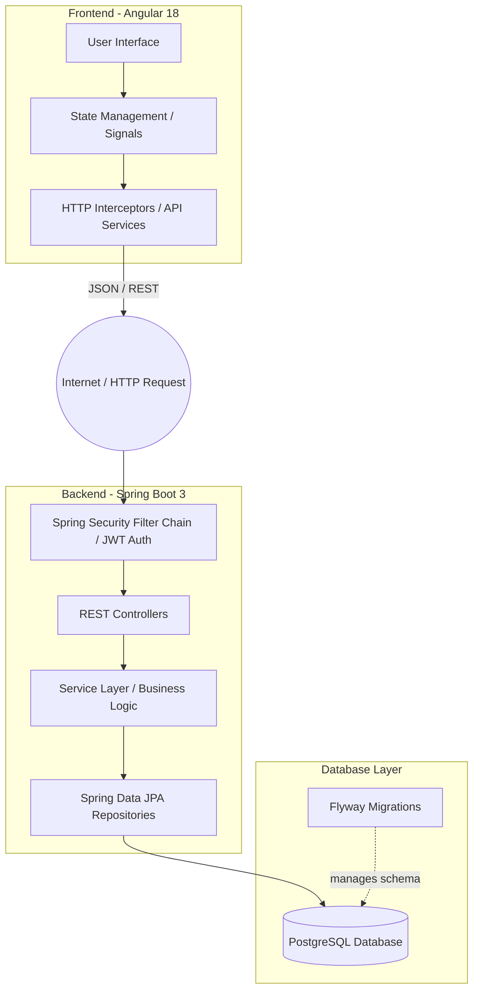
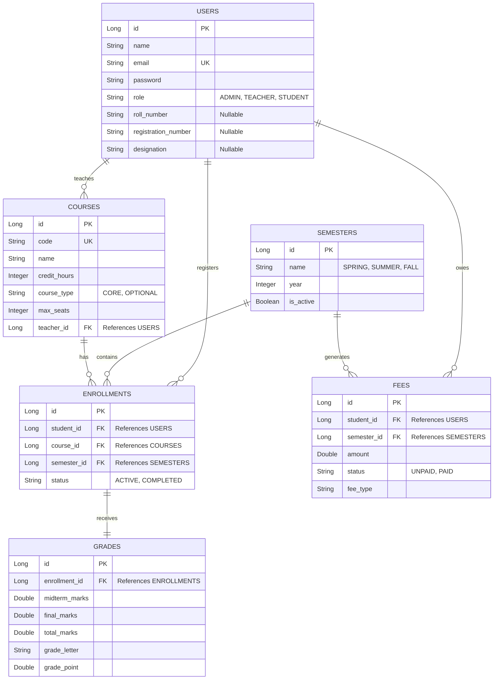

# System Architecture for SRS (Software Requirements Specification)

This document provides the architectural blueprint of the MIT Open Credit Management System. It is formatted to be directly integrated into the **System Architecture**, **Data Model**, and **Technical Stack** sections of your Software Requirements Specification (SRS) report.

---

## 1. System Overview

The MIT Credit Management System follows a classic **Client-Server Architecture** utilizing a decoupled frontend and backend. 
- The **Client** is a Single Page Application (SPA) built with Angular that runs in the user's web browser. 
- The **Server** is a RESTful API built with Spring Boot that handles business logic, security, and data persistence.
- Communication between the client and server is strictly via stateless HTTP/HTTPS protocols using JSON payloads.

---

## 2. Technology Stack

### Frontend (Client-Side)
- **Framework**: Angular 18 (Standalone Components, Signals for State Management)
- **Styling**: Custom CSS with Glassmorphism Design System (CSS Variables)
- **Routing**: Angular Router

### Backend (Server-Side)
- **Framework**: Spring Boot 3 (Java 21)
- **Security**: Spring Security with JWT (JSON Web Tokens) for stateless authentication.
- **ORM**: Spring Data JPA / Hibernate
- **Database Migration**: Flyway

### Database
- **Primary Database**: PostgreSQL (Relational Database Management System)

---

## 3. High-Level Architectural Diagram

*You can copy this Mermaid diagram into tools like draw.io or Notion to generate the visual diagram.*

---

## 4. Subsystem Decomposition (Core Modules)

The system is decomposed into five primary functional modules:

1. **Authentication & Authorization Module**: 
   - Handles User Registration, Login, and JWT Token issuance.
   - Enforces Role-Based Access Control (RBAC) separating Admin, Teacher, and Student roles.
2. **Course Management Module**:
   - Allows Admins to create, update, and deactivate courses.
   - Manages course metadata (credits, type, capacity).
3. **Semester & Enrollment Module**:
   - Manages the lifecycle of academic semesters (Spring, Summer, Fall).
   - Handles student course registration, ensuring students cannot exceed credit limits or enroll in full courses.
4. **Grading & Results Module**:
   - Allows Teachers to input midterm and final marks for their assigned courses.
   - Automatically calculates Total Marks, Grade Letters, and Grade Points.
   - Calculates the student's current Semester GPA and Cumulative GPA (CGPA).
5. **Fee Management Module**:
   - Generates financial dues based on enrollment and semester status.
   - Allows students to track and simulate payment of outstanding balances.

---

## 5. Entity Relationship Diagram (ERD)

This represents the core data model stored in PostgreSQL.

---

## 6. Security Architecture

1. **Authentication (Stateless)**: 
   - Upon successful login, the server generates an asymmetric JSON Web Token (JWT) signed with a secret key.
   - The client stores this JWT (in memory or `localStorage`) and attaches it as a `Bearer` token in the `Authorization` header of all subsequent API requests.
2. **Password Cryptography**: 
   - Passwords are never stored in plain text. They are hashed using **BCrypt** with a strong work factor before persistence.
3. **Authorization (RBAC)**:
   - Security Context is established per request via a custom JWT Filter.
   - Endpoints are protected via `@PreAuthorize("hasRole('ADMIN')")` ensuring vertical privilege escalation is prevented at the method level.
